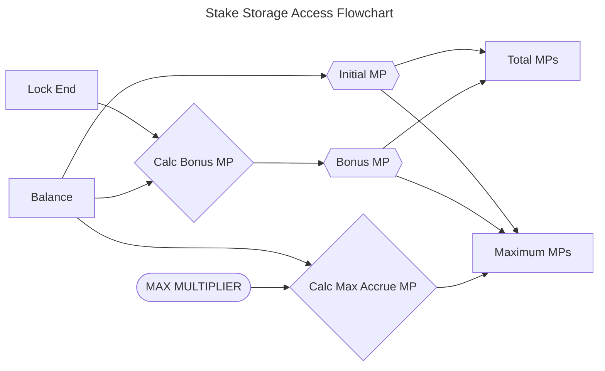
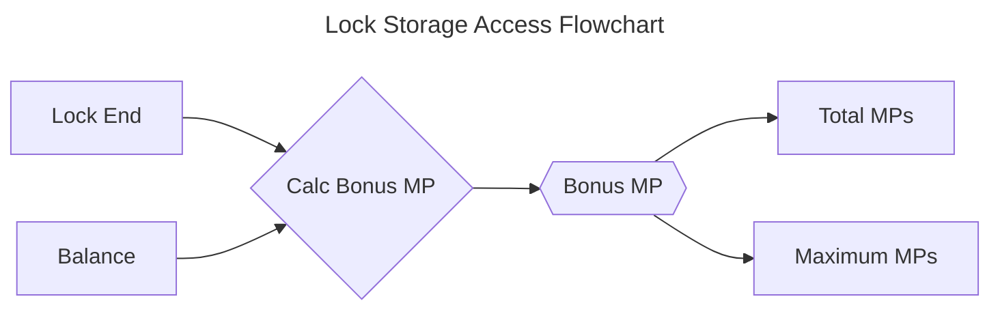
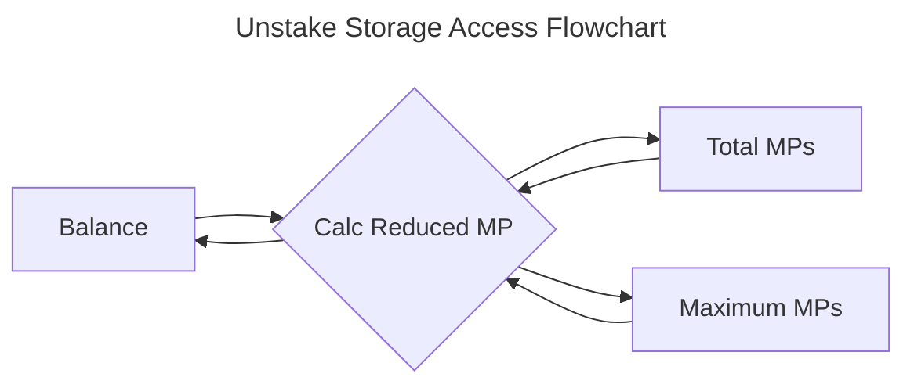
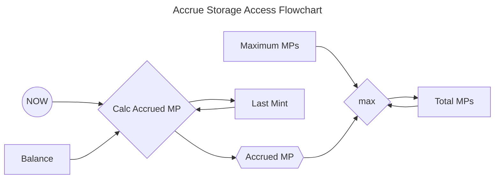

## Mathematical Specification of Staking Protocol

<!-- prettier-ignore -->
> [!IMPORTANT] 
> All values in this document are expressed as unsigned integers.

### Summary

### Constants

| Symbol                      | Source                                                                  | Value                   | Unit              | Description                                                                                                       |
| --------------------------- | ----------------------------------------------------------------------- | ----------------------- | ----------------- | ----------------------------------------------------------------------------------------------------------------- |
| $SCALE_{FACTOR}$            |                                                                         | $\pu{1 \times 10^{18}}$ | (1)               | Scaling factor to maintain precision in calculations.                                                             |
| $M_{MAX}$                   |                                                                         | $\pu{4 \mathrm{(1)}}$   | (1)               | Maximum multiplier of annual percentage yield.                                                                    |
| $\mathtt{APY}$              |                                                                         | 100                     | percent           | Annual percentage yield for multiplier points.                                                                    |
| $\mathsf{MPY}$              | $M_{MAX} \times \mathtt{APY}$                                           | 400                     | percent           | Multiplier points accrued maximum percentage yield                                                                |
| $\mathsf{MPY}_\mathit{abs}$ | $100 + (2 \times M_{\text{MAX}} \times \mathtt{APY})$                   | 900                     | percent           | Multiplier points absolute maximum percentage yield                                                               |
| $T_{RATE}$                  | (minimal blocktime)                                                     | 12                      | seconds           |                                                                                                                   |
| $T_{DAY}$                   |                                                                         | 86400                   | seconds           | One day.                                                                                                          |
| $T_{YEAR}$                  | $\lfloor365.242190 \times T_{DAY}\rfloor$                               | 31556925                | seconds           | One (mean) tropical year.                                                                                         |
| $A_{MIN}$                   | $\lceil\tfrac{T_{YEAR} \times 100}{T_{RATE} \times \mathtt{APY}}\rceil$ | 2629744                 | tokens per period | Minimal value to generate 1 multiplier point in the accrue rate period ($T_{RATE}$). ($A_{MIN} \propto T_{RATE}$) |
| $T_{MIN}$                   | $90 \times T_{DAY}$                                                     | 7776000                 | seconds           | Minimum lockup period, equivalent to 90 days.                                                                     |
| $T_{MAX}$                   | $M_{MAX} \times T_{YEAR}$                                               | 126227700               | seconds           | Maximum of lockup period.                                                                                         |

### Variables

#### System and User Parameters

##### $\Delta a\rightarrow$ Amount Difference

Difference in amount, can be either reduced or increased depending on context.

---

##### $\Delta t\rightarrow$ Time Difference of Last Accrual

---

The time difference defined as:

$$
\Delta t = t_{now} - t_{last}, \quad \text{where}  \Delta t > T_{RATE}
$$

---

##### $t_{lock}\rightarrow$ Time Lock Duration

A user-defined duration for which $a_{bal}$ remains locked.

---

##### $t_{now}\rightarrow$ Time Now

The current timestamp seconds since the Unix epoch (January 1, 1970).

---

##### $t_{lock, \Delta}\rightarrow$ Time Lock Remaining Duration

Seconds $a_{bal}$ remains locked, expressed as:

$$
\begin{align} &t_{lock, \Delta} = max(t_{lock,end},t_{now}) - t_{now}  \\
\text{ where: }\quad & t_{lock, \Delta} = 0\text{ or }T_{MIN} \le t_{lock, \Delta} \le (M_{MAX} \times T_{YEAR})\end{align}
$$

---

#### State Related

##### $a_{bal}\rightarrow$ Amount of Balance

Amount of tokens in balance, where $a_{bal} \ge A_{MIN}$.

---

##### $t_{lock,end}\rightarrow$ Time Lock End

Timestamp marking the end of the lock period, its state can be defined as:

$$
t_{lock,end} = \max(t_{now}, t_{lock,end}) + t_{lock}
$$

The value of $t_{lock,end}$ can be updated only within the functions:

- $\mathcal{f}^{stake}(\mathbb{Account}, \Delta a, \Delta t_{lock})$;
- $\mathcal{f}^{lock}(\mathbb{Account}, \Delta t_{lock})$;

---

##### $t_{last}\rightarrow$ Time of Accrual

Timestamp of the last accrued time, its state can be defined as:

$$
t_{last} = t_{now}
$$

The value of $t_{last}$ is updated by all functions that change state:

- $f^{accrue}(\mathbb{Account}, a_{bal},\Delta t)$,
- $\mathcal{f}^{stake}(\mathbb{Account}, \Delta a, \Delta t_{lock})$;
- $\mathcal{f}^{lock}(\mathbb{Account}, \Delta t_{lock})$;
- $\mathcal{f}^{unstake}(\mathbb{Account}, \Delta a)$;

---

##### $mp_\mathcal{M}\rightarrow$ Maximum Multiplier Points

Maximum value that $mp_\Sigma$ can reach.

Relates as $mp_\mathcal{M} \propto a_{bal} \cdot (t_{lock} + \mathsf{MPY})$.

Altered by functions that change the account state:

- $\mathcal{f}^{stake}(\mathbb{Account}, \Delta a, \Delta t_{lock})$;
- $\mathcal{f}^{lock}(\mathbb{Account}, \Delta t_{lock})$;
- $\mathcal{f}^{unstake}(\mathbb{Account}, \Delta a)$.

It's state can be expressed as the following state changes:

###### Increase in Balance and Lock

$$
\begin{aligned}
mp_\mathcal{M} &= mp_\mathcal{M} + mp_\mathcal{A}(\Delta a, M_{MAX} \times T_{YEAR}) \\
&\quad + mp_\mathcal{B}(\Delta a, t_{lock,\Delta} + t_{lock}) \\
&\quad + mp_\mathcal{B}(a_{bal}, t_{lock}) \\
&\quad + mp_\mathcal{I}(\Delta a)
\end{aligned}
$$

###### Increase in Balance only

$$
\begin{aligned}
mp_\mathcal{M} &= mp_\mathcal{M} + mp_\mathcal{A}(\Delta a, M_{MAX} \times T_{YEAR}) \\
&\quad + mp_\mathcal{B}(\Delta a, t_{lock,\Delta}) \\
&\quad + mp_\mathcal{I}(\Delta a)
\end{aligned}
$$

###### Increase in Lock only

$$
mp_\mathcal{M} = mp_\mathcal{M} + mp_\mathcal{B}(a_{bal}, t_{lock})
$$

###### Decrease in Balance

$$
mp_\mathcal{M} = mp_\mathcal{M} - mp_\mathcal{R}(mp_\mathcal{M}, a_{bal}, \Delta a)
$$

---

##### $mp_{\Sigma}\rightarrow$ Total Multiplier Points

Altered by all functions that change state:

- $\mathcal{f}^{stake}(\mathbb{Account}, \Delta a, \Delta t_{lock})$;
- $\mathcal{f}^{lock}(\mathbb{Account}, \Delta t_{lock})$;
- $\mathcal{f}^{unstake}(\mathbb{Account}, \Delta a)$;
- $f^{accrue}(\mathbb{Account}, a_{bal},\Delta t)$.

The state can be expressed as the following state changes:

###### For every $T_{RATE}$

$$
mp_{\Sigma} = min(\mathcal{f}mp_\mathcal{A}(a_{bal},\Delta t) ,mp_\mathcal{M} -  mp_\Sigma)
$$

###### Increase in Balance and Lock

$$
\begin{aligned}
mp_{\Sigma} &= mp_{\Sigma} + mp_\mathcal{B}(\Delta a, t_{lock, \Delta} + t_{lock}) \\
&\quad + mp_\mathcal{B}(a_{bal}, t_{lock}) \\
&\quad + mp_\mathcal{I}(\Delta a)
\end{aligned}
$$

###### Increase in Balance only

$$
mp_{\Sigma} = mp_{\Sigma} + mp_\mathcal{B}(\Delta a, t_{lock, \Delta}) + mp_\mathcal{I}(\Delta a)
$$

###### Increase in Lock only

$$
mp_{\Sigma} = mp_{\Sigma} + mp_\mathcal{B}(a_{bal}, t_{lock})
$$

###### Decrease in Balance

$$
mp_{\Sigma} = mp_{\Sigma} - mp_\mathcal{R}(mp_{\Sigma}, a_{bal}, \Delta a)
$$

---

##### $\mathbb{Account}\rightarrow$ Account Storage Schema

Defined as following:

$$
\begin{gather}
\mathbb{Account}  \\
\overbrace{\begin{align}
a_{bal} & : \text{balance},  \\
t_{lock,end} & : \text{lock end}, \\
t_{last} & : \text{last accrual}, \\
mp_\Sigma & : \text{total MPs}, \\
mp_\mathcal{M} & : \text{maximum MPs}
\end{align}}
\end{gather}
$$

---

##### $\mathbb{System}\rightarrow$ System Storage Schema

Defined as following:

$$
\begin{gather}
 \mathbb{System}  \\
\overbrace{\begin{align}
\mathbb{Account}\mathrm{[]} & : \text{accounts}, \\
a_{bal} & : \text{total staked}, \\
mp_\Sigma & : \text{MP supply}, \\
mp_\mathcal{M} & : \text{MP supply max}
\end{align}}
\end{gather}
$$

---

### Pure Mathematical Functions

<!-- prettier-ignore -->
> [!NOTE] 
> This function definitions represent direct mathematical input -> output methods, which don't change state.

#### Definition: $\mathcal{f}{mp_\mathcal{I}}(\Delta a) \longrightarrow$ Initial Multiplier Points

Calculates the initial multiplier points (**MPs**) based on the balance change $\Delta a$. The result is equal to the
amount of balance added.

$$
\boxed{
	\begin{equation}
		\mathcal{f}{mp_\mathcal{I}}(\Delta a) = \Delta a
	\end{equation}
}
$$

Where

- **$\Delta a$**: Represents the change in balance.

---

#### Definition: $\mathcal{f}{mp_\mathcal{A}}(a_{bal}, \Delta t) \longrightarrow$ Accrue Multiplier Points

Calculates the accrued multiplier points (**MPs**) over a time period **$\Delta t$**, based on the account balance
**$a_{bal}$** and the annual percentage yield $\mathtt{APY}$.

$$
\boxed{
	\begin{equation}
		\mathcal{f}mp_\mathcal{A}(a_{bal}, \Delta t) = \dfrac{a_{bal} \times \Delta t \times \mathtt{APY}}{100 \times T_{YEAR}}
	\end{equation}
}
$$

Where

- **$a_{bal}$**: Represents the current account balance.
- **$\Delta t$**: The time difference or the duration over which the multiplier points are accrued, expressed in the
  same time units as the year (typically days or months).
- **$T_{YEAR}$**: A constant representing the duration of a full year, used to normalize the time difference
  **$\Delta t$**.
- **$\mathtt{APY}$**: The Annual Percentage Yield (APY) expressed as a percentage, which determines how much the balance
  grows over a year.

---

#### Definition: $\mathcal{f}{mp_\mathcal{B}}(\Delta A, t_{lock}) \longrightarrow$ Bonus Multiplier Points

Calculates the bonus multiplier points (**MPs**) earned when a balance **$\Delta a$** is locked for a specified duration
**$t_{lock}$**. It is equivalent to the accrued multiplier points function
$\mathcal{f}mp_\mathcal{A}(\Delta a, t_{lock})$ but specifically applied in the context of a locked balance.

$$
\begin{aligned}
	&\mathcal{f}mp_\mathcal{B}(\Delta a, t_{lock})  = \mathcal{f}mp_\mathcal{A}(\Delta a, t_{lock}) \\
	&\boxed{
		\begin{equation}
			\mathcal{f}mp_\mathcal{B}(\Delta a, t_{lock})  = \dfrac{\Delta a \times t_{lock} \times \mathtt{APY}}{100 \times T_{YEAR}}
		\end{equation}
	}
\end{aligned}
$$

Where:

- **$\Delta a$**: Represents the amount of the balance that is locked.
- **$t_{lock}$**: The duration for which the balance **$\Delta a$** is locked, measured in units of seconds.
- **$T_{YEAR}$**: A constant representing the length of a year, used to normalize the lock period **$t_{lock}$** as a
  fraction of a full year.
- **$\mathtt{APY}$**: The Annual Percentage Yield (APY), expressed as a percentage, which indicates the yearly interest
  rate applied to the locked balance.

---

#### Definition: $\mathcal{f}{mp_\mathcal{R}}(mp, a_{bal}, \Delta a) \longrightarrow$ Reduce Multiplier Points

Calculates the reduction in multiplier points (**MPs**) when a portion of the balance **$\Delta a$** is removed from the
total balance **$a_{bal}$**. The reduction is proportional to the ratio of the removed balance to the total balance,
applied to the current multiplier points **$mp$**.

$$
\boxed{
	\begin{equation}
		\mathcal{f}{mp_\mathcal{R}}(mp, a_{bal}, \Delta a) = \dfrac{mp \times \Delta a}{ a_{bal}}
	\end{equation}
}
$$

Where:

- **$mp$**: Represents the current multiplier points.
- **$a_{bal}$**: The total account balance before the removal of **$\Delta a$**.
- **$\Delta a$**: The amount of balance being removed or deducted.

---

### State Functions

These function definitions represent methods that modify the state of both **$\mathbb{System}$** and
**$\mathbb{Account}$**. They perform various pure mathematical operations to implement the specified state changes,
affecting either the system as a whole and the individual account states.

#### Definition: $\mathcal{f}^{stake}(\mathbb{Account},\Delta A, t_{lock}) \longrightarrow$ Stake Amount With Lock

_Purpose:_ Allows a user to stake an amount $\Delta a$ with an optional lock duration $t_{lock}$.

##### Steps

###### Accrue Existing Multiplier Points (MPs)

Call the $\mathcal{f}_{accrue}(\mathbb{Account})$ function to update MPs and last accrual time.

###### Calculate the New Remaining Lock Period ($\Delta t_{lock}$)

$$
\Delta t_{lock} = max(\mathbb{Account} \cdot t_{lock,end}, t_{now}) + t_{lock} - t_{now}
$$

###### Verify Constraints

Ensure new balance ($a_{bal}$ + $\Delta a$) meets the minimum amount ($A_{MIN}$):

$$
\mathbb{Account} \cdot a_{bal} + \Delta a > A_{MIN}
$$

Ensure the New Remaining Lock Period ($\Delta t_{lock}$) is within Allowed Limits

$$
\Delta t_{lock} = 0 \lor T_{MIN} \le \Delta t_{lock} \le T_{MAX}
$$

###### Calculate Increased Bonus MPs

For the new amount ($\Delta a$) with the New Remaining Lock Period ($\Delta t_{lock}$):

$$
\Delta \hat{mp}^\mathcal{B} = \mathcal{f}mp_\mathcal{B}(\Delta a, \Delta t_{lock})
$$

For extending the lock ($t_{lock}$) on the existing balance ($\mathbb{Account} \cdot a_{bal}$):

$$
\Delta \hat{mp}^\mathcal{B} = \Delta \hat{mp}^\mathcal{B} + \mathcal{f}mp_\mathcal{B}(\mathbb{Account} \cdot a_{bal}, t_{lock})
$$

###### Calculate Increased Maximum MPs ($\Delta mp_\mathcal{M}$)

$$
\Delta mp_\mathcal{M} = \mathcal{f}mp_\mathcal{I}(\Delta a) + \Delta \hat{mp}^\mathcal{B} + \mathcal{f}mp_\mathcal{A}(\Delta a, M_{MAX} \times T_{YEAR})
$$

###### Calculate Increased Total MPs ($\Delta mp_\Sigma$)

$$
\Delta mp_\Sigma = \mathcal{f}mp_\mathcal{I}(\Delta a) + \Delta \hat{mp}^\mathcal{B}
$$

###### Verify Constraints

Ensure the New Maximum MPs ($\mathbb{Account} \cdot mp_\mathcal{M} + \Delta mp_\mathcal{M}$) is within the Absolute
Maximum MPs:

$$
\mathbb{Account} \cdot mp_\mathcal{M} + \Delta mp_\mathcal{M} \le \frac{a_{bal} \times \mathsf{MPY}_\mathit{abs}}{100}
$$

###### Update account State

Maximum MPs:

$$
\mathbb{Account} \cdot mp_\mathcal{M} = \mathbb{Account}\cdot mp_\mathcal{M} + \Delta mp_\mathcal{M}
$$

Total MPs:

$$
\mathbb{Account} \cdot mp_\Sigma = \mathbb{Account} \cdot mp_\Sigma + \Delta mp_\Sigma
$$

Balance:

$$
\mathbb{Account} \cdot a_{bal} = \mathbb{Account} \cdot a_{bal} + \Delta a
$$

Lock end time:

$$
\mathbb{Account} \cdot t_{lock,end} = max(\mathbb{Account} \cdot t_{lock,end}, t_{now}) + t_{lock}
$$

###### Update System State

Maximum MPs:

$$
\mathbb{System} \cdot mp_\mathcal{M} = \mathbb{System} \cdot mp_\mathcal{M} + \Delta mp_\mathcal{M}
$$

Total MPs:

$$
\mathbb{System} \cdot mp_\Sigma = \mathbb{System} \cdot mp_\Sigma + \Delta mp_\Sigma
$$

Total staked amount:

$$
\mathbb{System} \cdot a_{bal} = \mathbb{System} \cdot a_{bal} + \Delta a
$$

---

#### Definition: $\mathcal{f}^{lock}(\mathbb{Account}, t_{lock}) \longrightarrow$ Increase Lock

<!-- prettier-ignore -->
> [!NOTE] 
> Equivalent to $\mathcal{f}_{stake}(\mathbb{Account},0, t_{lock})$

_Purpose:_ Allows a user to lock the $\mathbb{Account} \cdot a_{bal}$ with a lock duration $t_{lock}$.

##### Steps

###### Accrue Existing Multiplier Points (MPs)

Call the $\mathcal{f}_{accrue}(\mathbb{Account})$ function to update MPs and last accrual time.

###### Calculate the New Remaining Lock Period ($\Delta t_{lock}$)

$$
\Delta t_{lock} = max(\mathbb{Account} \cdot t_{lock,end}, t_{now}) + t_{lock} - t_{now}
$$

###### Verify Constraints

Ensure the New Remaining Lock Period ($\Delta t_{lock}$) is within allowed limits:

$$
\Delta t_{lock} = 0 \lor T_{MIN} \le \Delta t_{lock} \le T_{MAX}
$$

###### Calculate Bonus MPs for the Increased Lock Period

$$
\Delta \hat{mp}^\mathcal{B} = mp_\mathcal{B}(\mathbb{Account} \cdot a_{bal}, t_{lock})
$$

###### Verify Constraints

Ensure the New Maximum MPs ($\mathbb{Account} \cdot mp_\mathcal{M} + \Delta \hat{mp}^\mathcal{B}$) is within the
Absolute Maximum MPs:

$$
\mathbb{Account} \cdot mp_\mathcal{M} + \Delta \hat{mp}^\mathcal{B} \le \frac{a_{bal} \times \mathsf{MPY}_\mathit{abs}}{100}

$$

###### Update account State

Maximum MPs:

$$
\mathbb{Account} \cdot mp_\mathcal{M} = \mathbb{Account} \cdot mp_\mathcal{M} + \Delta \hat{mp}^\mathcal{B}
$$

Total MPs:

$$
\mathbb{Account} \cdot mp_\Sigma = \mathbb{Account} \cdot mp_\Sigma + \Delta \hat{mp}^\mathcal{B}
$$

Lock end time:

$$
\mathbb{Account} \cdot t_{lock,end} = max(\mathbb{Account} \cdot t_{lock,end}, t_{now}) + t_{lock}
$$

###### Update System State

Maximum MPs:

$$
\mathbb{System} \cdot mp_\mathcal{M} = \mathbb{System} \cdot mp_\mathcal{M} + \Delta mp_\mathcal{B}
$$

Total MPs:

$$
\mathbb{System} \cdot mp_\Sigma = \mathbb{System} \cdot mp_\Sigma + \Delta mp_\mathcal{B}
$$

---

#### Definition: $\mathcal{f}^{unstake}(\mathbb{Account}, \Delta a) \longrightarrow$ Unstake Amount Unlocked

Purpose: Allows a user to unstake an amount $\Delta a$.

##### Steps

###### Accrue Existing Multiplier Points (MPs)

Call the $\mathcal{f}_{accrue}(\mathbb{Account})$ function to update MPs and last accrual time.

###### Verify Constraints

Ensure the account is not locked:

$$
\mathbb{Account} \cdot t_{lock,end} < t_{now}
$$

Ensure that account have enough balance:

$$
\mathbb{Account} \cdot a_{bal} > \Delta a
$$

Ensure that new balance ($\mathbb{Account} \cdot a_{bal} - \Delta a$) will be zero or more than minimum allowed:

$$
\mathbb{Account} \cdot a_{bal} - \Delta a = 0 \lor \mathbb{Account} \cdot a_{bal} - \Delta a > A_{MIN}
$$

###### Calculate Reduced Amounts

Maximum MPs:

$$
\Delta mp_\mathcal{M} =\mathcal{f}mp_\mathcal{R}(\mathbb{Account} \cdot mp_\mathcal{M}, \mathbb{Account} \cdot a_{bal}, \Delta a)
$$

Total MPs:

$$
\Delta  mp_\Sigma = \mathcal{f}mp_\mathcal{R}(\mathbb{Account} \cdot mp_\Sigma, \mathbb{Account} \cdot a_{bal}, \Delta a)
$$

###### Update account State

Maximum MPs:

$$
\mathbb{Account} \cdot mp_\mathcal{M} = \mathbb{Account} \cdot mp_\mathcal{M} - \Delta mp_\mathcal{M}
$$

Total MPs:

$$
\mathbb{Account} \cdot mp_\Sigma = \mathbb{Account} \cdot mp_\Sigma - \Delta mp_\Sigma
$$

Balance:

$$
\mathbb{Account} \cdot a_{bal} = \mathbb{Account} \cdot a_{bal} - \Delta a
$$

###### Update System State

Maximum MPs:

$$
\mathbb{System} \cdot mp_\mathcal{M} = \mathbb{System} \cdot mp_\mathcal{M} - \Delta mp_\mathcal{M}
$$

Total MPs:

$$
\mathbb{System} \cdot mp_\Sigma = \mathbb{System} \cdot mp_\Sigma - \Delta mp_\Sigma
$$

Total staked amount:

$$
\mathbb{System} \cdot a_{bal} = \mathbb{System} \cdot a_{bal} - \Delta a
$$

---

#### Definition: $\mathcal{f}^{accrue}(\mathbb{Account}) \longrightarrow$ Accrue Multiplier Points

Purpose: Accrue multiplier points (MPs) for the account based on the elapsed time since the last accrual.

##### Steps

###### Calculate the time Period since Last Accrual

$$
\Delta t = t_{now} - \mathbb{Account} \cdot t_{last}
$$

###### Verify Constraints

Ensure the accrual period is greater than the minimum rate period:

$$
\Delta t > T_{RATE}
$$

###### Calculate Accrued MP for the Accrual Period

$$
\Delta \hat{mp}^\mathcal{A} = min(\mathcal{f}mp_\mathcal{A}(\mathbb{Account} \cdot a_{bal},\Delta t) ,\mathbb{Account} \cdot mp_\mathcal{M} - \mathbb{Account} \cdot mp_\Sigma)
$$

###### Update account State

Total MPs:

$$
\mathbb{Account} \cdot mp_\Sigma = \mathbb{Account} \cdot mp_\Sigma + \Delta \hat{mp}^\mathcal{A}
$$

Last accrual time:

$$
\mathbb{Account} \cdot t_{last} = t_{now}
$$

###### Update System State

Total MPs:

$$
\mathbb{System} \cdot mp_\Sigma = \mathbb{System} \cdot mp_\Sigma + \Delta \hat{mp}^\mathcal{A}
$$

---

### Support Functions

#### Maximum Total Multiplier Points

The maximum total multiplier points that can be generated for a determined amount of balance and lock duration.

$$
\boxed{\hat{\mathcal{f}}mp_{\mathcal{M}}(a_{bal}, t_{\text{lock}}) = a_{bal} + \frac{a_{bal} \times \mathtt{APY} \times \left( M_{\text{MAX}} \times T_{\text{YEAR}} + t_{\text{lock}} \right)}{100 \times T_{\text{YEAR}}}}
$$

#### Maximum Accrued Multiplier Points

The maximum multiplier points that can be accrued over time for a determined amount of balance.

$$
\boxed{\hat{\mathcal{f}}mp_\Sigma^{max}(a_{bal}) = \frac{a_{bal} \times \mathsf{MPY}}{100}}
$$

#### Maximum Absolute Multiplier Points

The absolute maximum multiplier points that some balance could have, which is the sum of the bonus with maximum lockup
time and the maximum accrued multiplier points.

$$
\boxed{\hat{\mathcal{f}}mp_\mathcal{M}^\mathit{abs}(a_{bal}) = \frac{a_{bal} \times \mathsf{MPY}_\mathit{abs}}{100}}
$$

#### Locked Time ($t_{lock}$)

> [!CAUTION] If implemented with integers, for $a_{bal} < T_{YEAR}$, due precision loss, this values will be an
> approximation.

Estimates the time an account set as locked time.

$$
\boxed{
	\begin{equation}
		\hat{\mathcal{f}}\tilde{t}_{lock}(mp_{\mathcal{M}}, a_{bal}) \approx \left\lceil \frac{(mp_{\mathcal{M}} - a_{bal}) \times 100 \times T_{YEAR}}{a_{bal} \times \mathtt{APY}}\right\rceil - T_{\text{YEAR}} \times M_{\text{MAX}}
	\end{equation}
}
$$

Where:

- $mp_{\mathcal{M}}$: Maximum multiplier points calculated the $a_{bal}$
- $a_{bal}$: Account balance used to calculate the $mp_{\mathcal{M}}$

#### Remaining Time Lock Allowed to Increase

> [!CAUTION] If implemented with integers, for $a_{bal} < T_{YEAR}$, due precision loss, this values will be an
> approximation.

Retrieves how much time lock can be increased for an account.

$$
\boxed{
	\begin{equation}
		t_{lock}^{rem}(a_{bal},mp_\mathcal{M}) \approx \frac{(\frac{a_{bal} \times \mathsf{MPY}_\mathit{abs}}{100} - mp_\mathcal{M})\times T_{YEAR}}{a_{bal}}
	\end{equation}
}
$$
